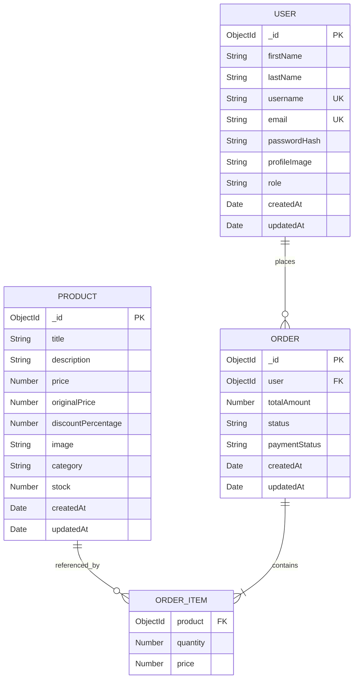

# ShopIn : Entity Relationship Diagram

## 1. Database Overview

ShopIn uses MongoDB as its primary database with Mongoose ODM for schema definition, validation, relationships, and database operations.

The core application entities are:

* User
* Product
* Order
* OrderItem

`OrderItem` represents an individual product purchased as part of an order.

In the MongoDB implementation, `OrderItem` is embedded inside the `Order` document rather than stored as a separate collection.

# 2. Entity Relationships

The main relationships are:

```text
User
 │
 │ places
 │
 └──────────< Order
                 │
                 │ contains
                 │
                 └──────────< OrderItem
                                  │
                                  │ references
                                  ▼
                               Product
```

### User → Order

One user can place zero or many orders.

Each order belongs to exactly one user.

```text
USER 1 ──────── N ORDER
```

### Order → OrderItem

One order contains one or more order items.

Each order item represents one product entry within the order.

```text
ORDER 1 ──────── N ORDER_ITEM
```

### Product → OrderItem

A product can appear in zero or many order items across different orders.

Each order item references one product.

```text
PRODUCT 1 ──────── N ORDER_ITEM
```

# 3. User Entity

The `User` entity represents customers and administrators.

### Fields

| Field            | Type     | Constraints          | Description             |
| ---------------- | -------- | -------------------- | ----------------------- |
| `_id`          | ObjectId | Primary Key          | Unique user identifier  |
| `firstName`    | String   | Required             | User first name         |
| `lastName`     | String   | Required             | User last name          |
| `username`     | String   | Required, Unique     | Login/user identifier   |
| `email`        | String   | Required, Unique     | User email              |
| `passwordHash` | String   | Required             | Hashed password         |
| `profileImage` | String   | Optional             | Profile image URL       |
| `role`         | String   | `user` / `admin` | User authorization role |
| `createdAt`    | Date     | Automatic            | Creation timestamp      |
| `updatedAt`    | Date     | Automatic            | Last update timestamp   |

### User Roles

Supported roles are:

```text
user
admin
```

The role determines which administrative functionality a user can access.

# 4. Product Entity

The `Product` entity represents products available in the ShopIn catalogue.

### Fields

| Field                  | Type     | Constraints    | Description               |
| ---------------------- | -------- | -------------- | ------------------------- |
| `_id`                | ObjectId | Primary Key    | Unique product identifier |
| `title`              | String   | Required       | Product name              |
| `description`        | String   | Optional       | Product description       |
| `price`              | Number   | Required, >= 0 | Current selling price     |
| `originalPrice`      | Number   | Optional, >= 0 | Original product price    |
| `discountPercentage` | Number   | 0–100         | Discount percentage       |
| `image`              | String   | Optional       | Product image URL         |
| `category`           | String   | Optional       | Product category          |
| `stock`              | Number   | >= 0           | Available inventory       |
| `createdAt`          | Date     | Automatic      | Creation timestamp        |
| `updatedAt`          | Date     | Automatic      | Last update timestamp     |

# 5. Order Entity

The `Order` entity represents a completed customer order.

### Fields

| Field             | Type     | Constraints                 | Description                   |
| ----------------- | -------- | --------------------------- | ----------------------------- |
| `_id`           | ObjectId | Primary Key                 | Unique order identifier       |
| `user`          | ObjectId | Required, Foreign Reference | Customer who placed the order |
| `items`         | Array    | Required                    | Embedded order items          |
| `totalAmount`   | Number   | Required, >= 0              | Total order amount            |
| `status`        | String   | Enum                        | Current order state           |
| `paymentStatus` | String   | Enum                        | Payment state                 |
| `createdAt`     | Date     | Automatic                   | Order creation time           |
| `updatedAt`     | Date     | Automatic                   | Last update time              |

### Order Status Values

```text
pending
paid
shipped
delivered
cancelled
```

### Payment Status Values

```text
pending
paid
failed
```

# 6. OrderItem Entity

`OrderItem` is an embedded subdocument within an `Order`.

It is not stored as an independent MongoDB collection.

### Fields

| Field        | Type     | Constraints                 | Description                 |
| ------------ | -------- | --------------------------- | --------------------------- |
| `product`  | ObjectId | Required, Product Reference | Product purchased           |
| `quantity` | Number   | Required, >= 1              | Number of units purchased   |
| `price`    | Number   | Required, >= 0              | Product price at order time |

The `price` field is intentionally stored in the order item.

This preserves the historical price of a product at the time the order was created. If the product price changes later, existing orders continue to display the original purchase price.

# 7. ERD Diagram



# 8. Relationship Summary

| Relationship         | Cardinality | Meaning                                    |
| -------------------- | ----------- | ------------------------------------------ |
| User → Order        | 1 : N       | A user can place multiple orders           |
| Order → OrderItem   | 1 : N       | An order contains multiple purchased items |
| Product → OrderItem | 1 : N       | A product can appear in multiple orders    |

# 9. Normalization and Data Design

The database design separates reusable product and user information from order-specific information.

Products are stored independently so that catalogue information can be updated without duplicating complete product documents inside every order.

Orders store references to users and products.

Order items additionally store the purchase-time price to preserve historical transaction information.

This provides a practical balance between normalized references and the document-oriented structure of MongoDB.

# 10. Data Integrity Rules

The following rules apply to the database:

1. Usernames must be unique.
2. Email addresses must be unique.
3. User roles must be either `user` or `admin`.
4. Product prices cannot be negative.
5. Product stock cannot be negative.
6. Discount percentage must remain between 0 and 100.
7. Order totals cannot be negative.
8. Order item quantities must be at least 1.
9. Order item prices cannot be negative.
10. Every order must reference a valid user.
11. Every order item must reference a product.
12. Order status must use one of the defined status values.
13. Payment status must use one of the defined payment states.

# 11. MongoDB Document Structure

Conceptually, an order document has the following structure:

```text
Order
│
├── _id
├── user
├── items
│   ├── product
│   ├── quantity
│   └── price
│
├── totalAmount
├── status
├── paymentStatus
├── createdAt
└── updatedAt
```

The embedded `items` array allows the complete purchase composition to be retrieved as part of the order document.

# 12. Database Technology

### Database

MongoDB

### ODM

Mongoose

### Primary Data Model

Document-oriented

### Relationship Strategy

MongoDB ObjectId references combined with embedded order-item subdocuments.

### Primary Collections

```text
users
products
orders
```

`OrderItem` does not have its own collection because it is embedded within the `orders` collection.

# 13. ERD Implementation Mapping

The ERD directly maps to the application's Mongoose models:

```text
models/
├── User.js
├── Product.js
└── Order.js
```

The `Order.js` model contains the embedded `items` structure representing `OrderItem`.

This keeps the database documentation aligned with the actual backend implementation.
