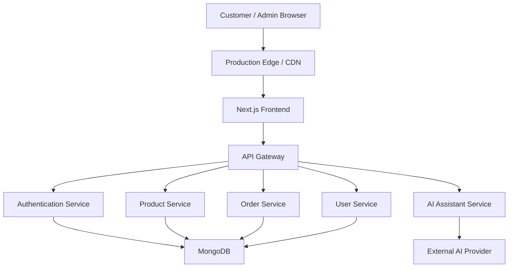
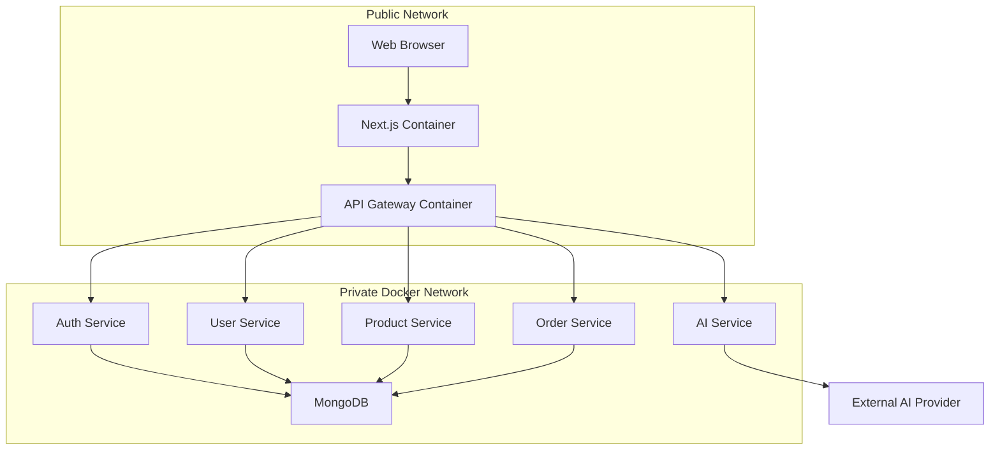
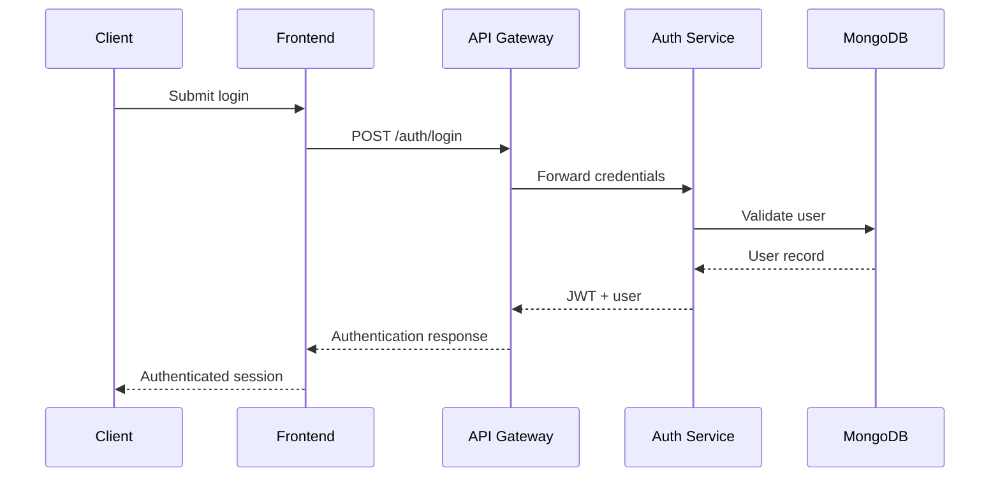
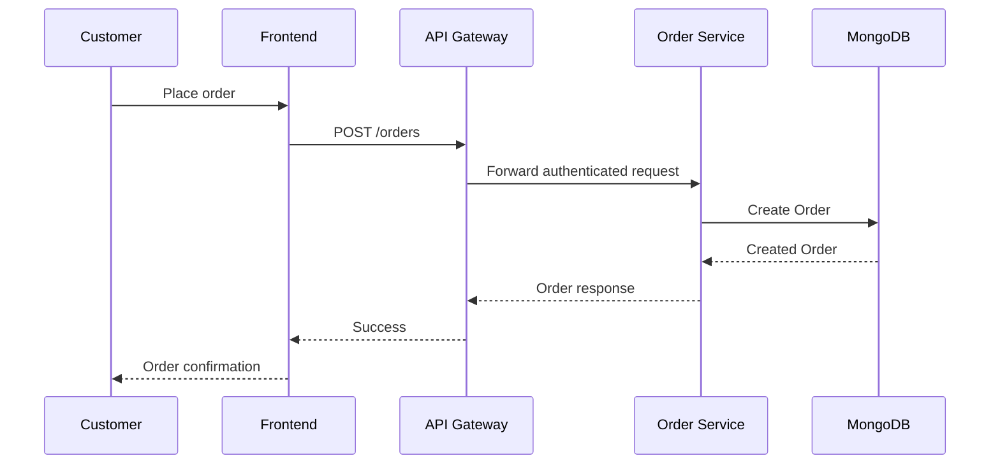
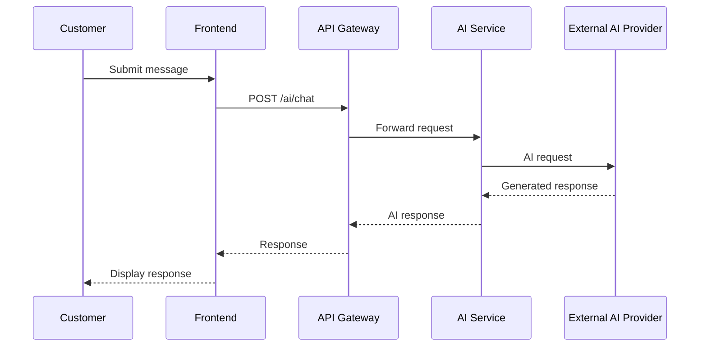

# ShopIn : System Architecture

## 1. Architecture Overview

ShopIn is designed as a full-stack e-commerce platform with separated presentation, API, authentication, business-processing, AI, and data layers.

The current implementation uses a modular Express.js backend.

The architecture blueprint defines how these responsibilities can be isolated into independently deployable services using Docker containers and internal networking.

The architecture is designed around:

* Separation of concerns
* Independent service responsibilities
* Secure internal communication
* Containerized deployment
* Scalable data access
* Clear frontend/backend boundaries

# 2. High-Level Architecture



The browser communicates with the Next.js frontend through the production edge layer.

The frontend communicates with backend functionality through an API gateway.

The gateway routes requests to the appropriate backend service.

The backend services communicate with MongoDB for application data, while the AI service communicates with an external AI provider.

# 3. Frontend Architecture

The frontend is implemented using Next.js and provides the presentation layer of ShopIn.

### Main responsibilities

* Product browsing
* Authentication interfaces
* Cart management
* Checkout
* Order history
* User profile management
* Admin dashboard
* AI shopping assistant
* Responsive user interface
* Dark/light theme management

### Frontend structure

```text
Next.js Frontend
│
├── App Router
│
├── Pages
│   ├── Home
│   ├── Cart
│   ├── Checkout
│   ├── Orders
│   ├── Profile
│   └── Admin
│
├── Components
│   ├── Products
│   ├── Authentication
│   ├── Cart
│   ├── Checkout
│   ├── Orders
│   └── Admin
│
└── Redux Store
    ├── Authentication State
    ├── Cart State
    ├── User State
    └── UI State
```

Redux Toolkit and RTK Query are used for centralized client state and API communication.

# 4. Backend Architecture

The backend is implemented using Express.js and follows a modular architecture.

The backend separates responsibilities into:

* Routes
* Controllers
* Middleware
* Models
* Database configuration

```text
Express Backend
│
├── Routes
│   ├── Authentication
│   ├── Products
│   ├── Users
│   ├── Orders
│   └── AI
│
├── Controllers
│   ├── Authentication
│   ├── Products
│   ├── Users
│   ├── Orders
│   └── AI
│
├── Middleware
│   └── Authentication / Authorization
│
├── Models
│   ├── User
│   ├── Product
│   └── Order
│
└── Database
    └── MongoDB
```

This structure keeps HTTP routing, business logic, authentication, and persistence responsibilities separate.

# 5. Authentication Architecture

ShopIn uses token-based authentication.

The authentication flow is:

1. A user submits login credentials.
2. The frontend sends the credentials to the authentication API.
3. The backend validates the user.
4. The backend generates an authentication token.
5. The frontend stores the authenticated user state.
6. Protected API requests include the authentication token.
7. Authentication middleware validates the token before allowing access.

Authentication is applied to protected resources such as user profiles and orders.

# 6. Data Architecture

MongoDB is used as the primary application database.

Mongoose provides schema definitions, validation, relationships, and database access.

The main entities are:

```text
User
 │
 └──< Order
        │
        └──< OrderItem >── Product
```

### User

Stores:

* Identity information
* Username
* Email
* Password hash
* Profile image
* Role
* Timestamps

### Product

Stores:

* Product title
* Description
* Price
* Original price
* Discount percentage
* Image
* Category
* Stock
* Timestamps

### Order

Stores:

* Customer reference
* Ordered products
* Quantities
* Product prices
* Total amount
* Order status
* Payment status
* Timestamps

The detailed database design is documented separately in `docs/ERD.md`.

# 7. Docker Architecture

The production architecture is designed to support containerized services.



The public network exposes only the required frontend and gateway entry points.

Internal services communicate through a private Docker network.

The database is not directly exposed to the public internet.

This architecture allows individual services to be scaled or deployed independently as the platform grows.

# 8. API Layer

The API layer provides communication between the frontend and backend services.

The main API domains are:

| Domain        | Responsibility                |
| ------------- | ----------------------------- |
| `/auth`     | Registration and login        |
| `/products` | Product management            |
| `/users`    | User and profile management   |
| `/orders`   | Order creation and management |
| `/ai`       | AI shopping assistant         |

The frontend communicates with these endpoints using HTTP requests.

RTK Query is used to manage API requests, caching, loading states, and cache invalidation.

# 9. Security Architecture

Security is handled across multiple layers.

### Authentication

Protected resources require a valid authentication token.

### Authorization

User roles are represented through the `role` field in the User model.

Supported roles are:

```text
user
admin
```

### Password Security

Passwords are stored as password hashes rather than plain-text passwords.

### API Protection

Backend middleware is responsible for validating authentication before protected operations.

### Database Protection

MongoDB is intended to remain inside the protected backend/data layer rather than being directly accessible from the client.

### Environment Variables

Sensitive configuration such as:

* Database connection strings
* API credentials
* External service keys
* Deployment configuration

is stored using environment variables rather than committed source code.

# 10. Authentication Request Flow



This flow separates the presentation layer from authentication and database access.

---

# 11. Order Processing Flow



The order service validates the request and creates the order record associated with the authenticated customer.

# 12. AI Assistant Request Flow



The AI service acts as an abstraction layer between the ShopIn frontend and the external AI provider.

This prevents the frontend from directly communicating with the external AI provider.

# 13. Deployment Architecture

The production deployment consists of separate frontend and backend environments.

```text
                    Internet
                       │
                       ▼
              ┌─────────────────┐
              │ Production Edge │
              └────────┬────────┘
                       │
              ┌────────▼────────┐
              │ Next.js Frontend│
              │     Vercel      │
              └────────┬────────┘
                       │ HTTPS
                       ▼
              ┌─────────────────┐
              │ Express Backend │
              │     Render      │
              └────────┬────────┘
                       │
                       ▼
              ┌─────────────────┐
              │    MongoDB      │
              │     Database    │
              └─────────────────┘
```

The frontend is deployed as a Next.js application.

The Express backend is deployed separately as an API service.

MongoDB provides persistent application storage.

Environment variables are configured independently for each deployment environment.

# 14. Scalability Strategy

The architecture is designed to support future growth.

Potential scaling strategies include:

* Horizontal scaling of backend services
* Independent deployment of business services
* API gateway-based routing
* Database indexing
* Query optimization
* API response caching
* CDN-based static asset delivery
* Background processing for long-running operations
* Independent scaling of the AI service

The modular architecture allows high-traffic services to be scaled without requiring the entire application to scale together.

# 15. Failure Handling

The system should handle common failures without exposing internal implementation details to users.

Examples include:

### Authentication failure

Return an appropriate authentication error and require the user to log in again.

### Invalid product request

Return a validation error without modifying the database.

### Order creation failure

Return an error response and keep the cart available so the customer can retry.

### Database failure

Return a controlled server error while logging the underlying failure for debugging.

### AI provider failure

Return a controlled AI service error instead of exposing external provider details to the customer.

# 16. Architecture Principles

ShopIn follows these architectural principles:

1. **Separation of concerns**
   Each application layer has a clearly defined responsibility.
2. **Modularity**
   Backend functionality is organized into independent domains.
3. **Security by design**
   Authentication, authorization, environment variables, and protected database access are incorporated into the architecture.
4. **Scalability**
   Services can be independently scaled as traffic increases.
5. **Maintainability**
   Routes, controllers, models, middleware, and frontend state are separated.
6. **API-first communication**
   Frontend and backend communicate through defined HTTP APIs.
7. **Container readiness**
   The architecture can be transitioned from the current modular backend to independently deployable Docker services.

# 17. Current Implementation vs Target Architecture

The current Sprint 13 implementation uses a modular Express.js backend rather than a fully deployed microservices environment.

```text
CURRENT

Next.js
   │
   ▼
Express.js
   │
   ├── Auth
   ├── Users
   ├── Products
   ├── Orders
   └── AI
   │
   ▼
MongoDB
```

The target architecture separates these responsibilities into independently deployable services.

```text
TARGET

Next.js
   │
   ▼
API Gateway
   │
   ├── Auth Service
   ├── User Service
   ├── Product Service
   ├── Order Service
   └── AI Service
           │
           ▼
       Data Layer
```

This distinction is intentional: the current implementation provides a working modular foundation, while the architecture blueprint defines how the platform can evolve into a containerized service-oriented system.
